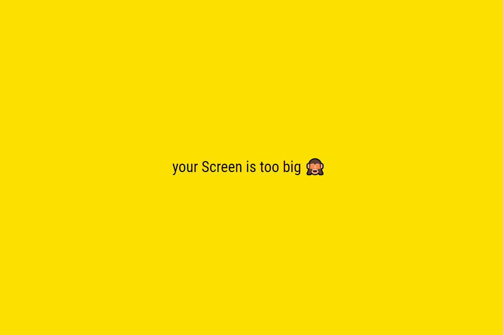

# Kakao Clone Challenge

[See the final version of Kakao Clone](https://tsple.github.io/kakao-clone/login.html)👈

- [Screen Size Warning](#1-screen-size-warning)
- [Header Wrapper](#2-header-wrapper)
- [Friends Page](#3-friends-page)
- [Chats Page](#4-chats-page)
- [Find Page](#5-find-page)
- [Kakao Pay](#6-kakao-pay)
- [Settings Page](#7-settings-page)

---

## 1. Screen Size Warning

If your screen width is over 645px, the following page appears.

## 2. Header Wrapper

Add `header wrapper` to all pages. So although you scroll the page, the header is fixed.

## 3. Friends Page

## 4. Chats Page

## 5. Find Page

## 6. Kakao Pay

Today's Kakao Talk has Kakao Pay. So I added `Kakao Pay Tab` to the page.

## 7. Settings Page

